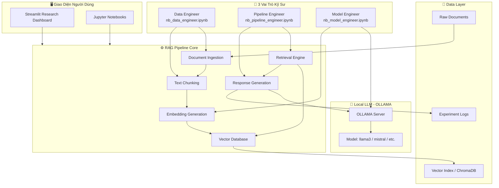
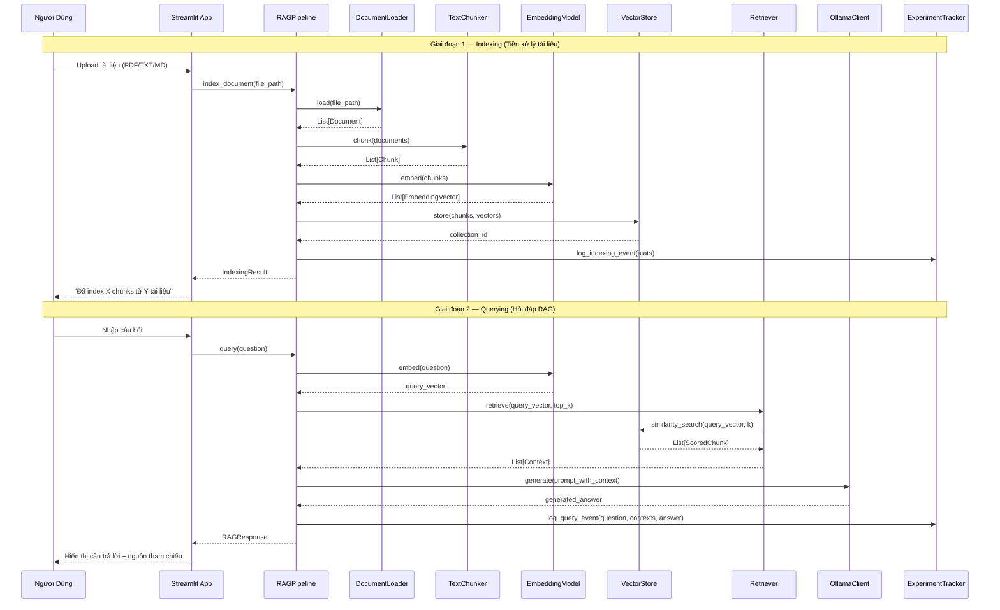
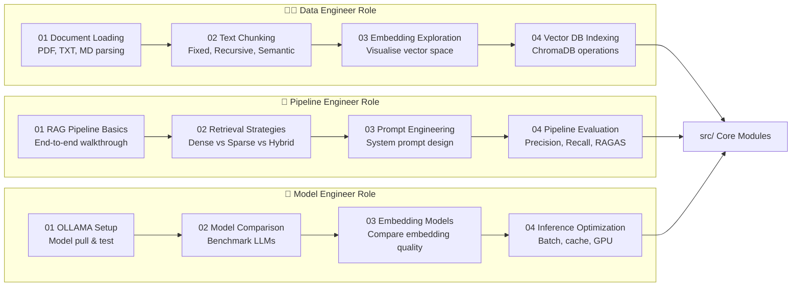

# Tài Liệu Thiết Kế: AI Research Assistant with RAG

## Tổng Quan

AI Research Assistant with RAG là một hệ thống nghiên cứu (research-oriented) được xây dựng nhằm mục tiêu học tập, thực nghiệm và khám phá từng thành phần của kiến trúc RAG (Retrieval-Augmented Generation). Dự án tổ chức theo 3 vai trò kỹ sư AI rõ ràng — **Data Engineer**, **Pipeline Engineer**, và **Model Engineer** — mỗi vai trò có Jupyter Notebook riêng để thực nghiệm tương tác.

Hệ thống sử dụng **OLLAMA** để chạy LLM cục bộ (không cần internet), **Streamlit** làm research dashboard, và một cấu trúc thư mục phân tách rõ ràng giữa code nghiên cứu (notebooks), code triển khai (src), và dữ liệu. Điểm nhấn khác biệt so với các phiên bản production là Jupyter Notebooks cho phép khám phá từng bước của RAG pipeline một cách tương tác và có thể tái lặp (reproducible experiments).

---

## Phần 1: High-Level Design

### 1.1 Kiến Trúc Tổng Thể



### 1.2 Cấu Trúc Thư Mục

```
rag-research-assistant/
│
├── 📓 notebooks/                          # Jupyter Notebooks theo vai trò
│   ├── data_engineer/
│   │   ├── 01_document_loading.ipynb      # Tải và khám phá tài liệu
│   │   ├── 02_text_chunking.ipynb         # Thực nghiệm chiến lược chunking
│   │   ├── 03_embedding_exploration.ipynb # Phân tích embedding vectors
│   │   └── 04_vector_db_indexing.ipynb    # Xây dựng và query vector DB
│   │
│   ├── pipeline_engineer/
│   │   ├── 01_rag_pipeline_basics.ipynb   # RAG pipeline từ đầu đến cuối
│   │   ├── 02_retrieval_strategies.ipynb  # So sánh chiến lược retrieval
│   │   ├── 03_prompt_engineering.ipynb    # Thiết kế và tối ưu prompt
│   │   └── 04_pipeline_evaluation.ipynb   # Đánh giá chất lượng pipeline
│   │
│   └── model_engineer/
│       ├── 01_ollama_setup.ipynb          # Cài đặt và test OLLAMA
│       ├── 02_model_comparison.ipynb      # So sánh các model LLM
│       ├── 03_embedding_models.ipynb      # Thực nghiệm embedding models
│       └── 04_inference_optimization.ipynb # Tối ưu tốc độ inference
│
├── 🧩 src/                                # Source code tái sử dụng
│   ├── __init__.py
│   ├── data/                              # Data Engineer module
│   │   ├── __init__.py
│   │   ├── loader.py                      # DocumentLoader class
│   │   ├── chunker.py                     # TextChunker class
│   │   └── preprocessor.py               # TextPreprocessor class
│   │
│   ├── embeddings/                        # Embedding module
│   │   ├── __init__.py
│   │   ├── embedding_model.py             # EmbeddingModel class
│   │   └── vector_store.py               # VectorStore class (ChromaDB)
│   │
│   ├── retrieval/                         # Retrieval module
│   │   ├── __init__.py
│   │   ├── retriever.py                   # Retriever class
│   │   └── reranker.py                    # Reranker class (optional)
│   │
│   ├── generation/                        # Generation module
│   │   ├── __init__.py
│   │   ├── llm_client.py                  # OllamaClient class
│   │   ├── prompt_builder.py              # PromptBuilder class
│   │   └── response_generator.py         # ResponseGenerator class
│   │
│   └── pipeline/                          # Pipeline orchestration
│       ├── __init__.py
│       ├── rag_pipeline.py               # RAGPipeline class
│       └── experiment_tracker.py         # ExperimentTracker class
│
├── 🖥️ app/                                # Streamlit Research Dashboard
│   ├── main.py                            # Entry point
│   ├── pages/
│   │   ├── 01_document_upload.py          # Upload & index tài liệu
│   │   ├── 02_chat_interface.py           # Giao diện hỏi đáp RAG
│   │   ├── 03_retrieval_debug.py          # Debug retrieval results
│   │   └── 04_experiment_log.py           # Xem lịch sử thực nghiệm
│   └── components/
│       ├── chat_widget.py
│       └── metrics_widget.py
│
├── 📊 data/
│   ├── raw/                               # Tài liệu gốc
│   ├── processed/                         # Tài liệu đã chunked
│   └── vector_db/                         # ChromaDB persistent storage
│
├── 📈 experiments/                        # Kết quả thực nghiệm
│   ├── logs/
│   └── results/
│
├── ⚙️ config/
│   ├── settings.py                        # Cấu hình hệ thống
│   └── models.yaml                        # Danh sách OLLAMA models
│
├── 🧪 tests/
│   ├── test_loader.py
│   ├── test_chunker.py
│   ├── test_retriever.py
│   └── test_pipeline.py
│
├── requirements.txt
├── README.md
└── .env.example
```

### 1.3 Luồng Dữ Liệu Chính



### 1.4 Sơ Đồ Vai Trò và Notebook



---

## Phần 2: Low-Level Design

### 2.1 Data Models

```python
from dataclasses import dataclass, field
from typing import List, Optional, Dict, Any
from enum import Enum
import datetime


class ChunkStrategy(Enum):
    """Chiến lược chia nhỏ văn bản"""
    FIXED_SIZE = "fixed_size"         # Cắt theo số ký tự cố định
    RECURSIVE = "recursive"           # Đệ quy theo separator
    SEMANTIC = "semantic"             # Theo ngữ nghĩa (sentence boundary)


class DocumentType(Enum):
    """Loại tài liệu được hỗ trợ"""
    PDF = "pdf"
    TXT = "txt"
    MARKDOWN = "markdown"
    HTML = "html"


@dataclass
class Document:
    """Đại diện một tài liệu gốc sau khi tải"""
    doc_id: str
    file_path: str
    doc_type: DocumentType
    content: str
    metadata: Dict[str, Any] = field(default_factory=dict)
    # metadata có thể chứa: {"source": "...", "page": 1, "author": "..."}


@dataclass
class Chunk:
    """Một đoạn văn bản nhỏ được tách từ Document"""
    chunk_id: str
    doc_id: str                        # Tham chiếu đến Document gốc
    content: str
    start_index: int                   # Vị trí bắt đầu trong document gốc
    end_index: int
    metadata: Dict[str, Any] = field(default_factory=dict)


@dataclass
class EmbeddingVector:
    """Vector embedding của một Chunk"""
    chunk_id: str
    vector: List[float]
    model_name: str                    # Tên embedding model đã dùng
    dimension: int                     # Số chiều của vector


@dataclass
class ScoredChunk:
    """Chunk kèm điểm similarity từ kết quả retrieval"""
    chunk: Chunk
    score: float                       # Cosine similarity score [0.0 - 1.0]
    rank: int                          # Thứ hạng trong kết quả retrieval


@dataclass
class RAGResponse:
    """Kết quả trả về từ toàn bộ RAG pipeline"""
    question: str
    answer: str
    contexts: List[ScoredChunk]        # Các chunk được dùng làm context
    model_name: str                    # Tên LLM đã dùng để sinh câu trả lời
    latency_ms: float                  # Thời gian xử lý (milliseconds)
    timestamp: datetime.datetime = field(default_factory=datetime.datetime.now)


@dataclass
class IndexingResult:
    """Kết quả sau khi index một tài liệu"""
    doc_id: str
    num_chunks: int
    collection_name: str
    success: bool
    error_message: Optional[str] = None


@dataclass
class ExperimentLog:
    """Ghi chú một lần thực nghiệm"""
    experiment_id: str
    event_type: str                    # "indexing" hoặc "query"
    params: Dict[str, Any]            # Các tham số thực nghiệm
    result: Dict[str, Any]            # Kết quả thực nghiệm
    timestamp: datetime.datetime = field(default_factory=datetime.datetime.now)
```

### 2.2 Core Interfaces

```python
from abc import ABC, abstractmethod
from typing import List, Optional


class BaseLoader(ABC):
    """Interface cho các Document Loader"""

    @abstractmethod
    def load(self, file_path: str) -> Document:
        """
        Tải một tài liệu từ đường dẫn file.
        
        Preconditions:
          - file_path trỏ đến file tồn tại
          - file_path có extension được hỗ trợ (.pdf, .txt, .md)
        
        Postconditions:
          - Trả về Document với content không rỗng
          - Document.doc_id là duy nhất
        """
        pass

    @abstractmethod
    def supports(self, file_path: str) -> bool:
        """Kiểm tra loader có hỗ trợ loại file này không"""
        pass


class BaseChunker(ABC):
    """Interface cho các Text Chunker"""

    @abstractmethod
    def chunk(self, document: Document) -> List[Chunk]:
        """
        Chia nhỏ document thành danh sách các chunk.
        
        Preconditions:
          - document.content không rỗng
        
        Postconditions:
          - Trả về list ít nhất 1 Chunk
          - Mỗi Chunk.doc_id == document.doc_id
          - Nối tất cả Chunk.content phải bao phủ document.content gốc
        
        Loop Invariant (trong vòng lặp tạo chunks):
          - Tất cả chunks đã tạo đều có doc_id hợp lệ
          - Không có nội dung bị mất giữa các lần lặp
        """
        pass


class BaseEmbeddingModel(ABC):
    """Interface cho các Embedding Model"""

    @abstractmethod
    def embed_text(self, text: str) -> List[float]:
        """
        Tạo embedding vector cho một đoạn văn bản.
        
        Preconditions:
          - text không rỗng
          - text có độ dài <= max_token_limit của model
        
        Postconditions:
          - Trả về list[float] có độ dài == self.dimension
          - Cùng một text luôn trả về cùng một vector (deterministic)
        """
        pass

    @abstractmethod
    def embed_batch(self, texts: List[str]) -> List[List[float]]:
        """
        Tạo embedding cho nhiều văn bản cùng lúc (hiệu quả hơn embed_text lặp lại).
        
        Postconditions:
          - len(result) == len(texts)
          - result[i] == embed_text(texts[i]) với mọi i
        """
        pass

    @property
    @abstractmethod
    def dimension(self) -> int:
        """Số chiều của embedding vector"""
        pass


class BaseVectorStore(ABC):
    """Interface cho Vector Store / Database"""

    @abstractmethod
    def add(self, chunks: List[Chunk], vectors: List[List[float]]) -> bool:
        """
        Lưu trữ chunks cùng với embedding vectors.
        
        Preconditions:
          - len(chunks) == len(vectors)
          - Mỗi vector có cùng dimension
        
        Postconditions:
          - Tất cả chunks có thể truy xuất được bằng similarity_search
          - Trả về True nếu thành công
        """
        pass

    @abstractmethod
    def similarity_search(
        self, query_vector: List[float], k: int = 5
    ) -> List[ScoredChunk]:
        """
        Tìm k chunks gần nhất với query_vector.
        
        Preconditions:
          - len(query_vector) == dimension của store
          - k >= 1
        
        Postconditions:
          - len(result) <= k
          - result được sắp xếp theo score giảm dần
          - Mỗi ScoredChunk.score thuộc [0.0, 1.0]
        """
        pass

    @abstractmethod
    def delete_collection(self, collection_name: str) -> bool:
        """Xóa toàn bộ collection"""
        pass


class BaseLLMClient(ABC):
    """Interface cho LLM Client"""

    @abstractmethod
    def generate(self, prompt: str, **kwargs) -> str:
        """
        Gọi LLM để sinh văn bản từ prompt.
        
        Preconditions:
          - prompt không rỗng
          - LLM server (OLLAMA) đang chạy
        
        Postconditions:
          - Trả về string không rỗng
          - Không có side effect ngoài network call
        """
        pass

    @abstractmethod
    def is_available(self) -> bool:
        """Kiểm tra LLM server có sẵn sàng không"""
        pass
```

### 2.3 Key Classes — Function Signatures

#### DocumentLoader

```python
class DocumentLoader(BaseLoader):
    """
    Tải tài liệu từ file và trả về Document object.
    Hỗ trợ: PDF (PyMuPDF), TXT, Markdown.
    """

    def __init__(self):
        self._loaders: Dict[str, BaseLoader] = {}  # extension -> loader

    def load(self, file_path: str) -> Document:
        """Tải file, tự động chọn loader phù hợp theo extension"""
        ...

    def load_directory(self, dir_path: str) -> List[Document]:
        """Tải tất cả tài liệu hỗ trợ trong một thư mục"""
        ...

    def supports(self, file_path: str) -> bool:
        """Kiểm tra có loader cho loại file này không"""
        ...

    def _get_extension(self, file_path: str) -> str:
        """Trích xuất extension từ đường dẫn"""
        ...

    def _generate_doc_id(self, file_path: str) -> str:
        """Tạo doc_id duy nhất (hash của đường dẫn tuyệt đối)"""
        ...
```

#### TextChunker

```python
class TextChunker(BaseChunker):
    """
    Chia nhỏ document theo nhiều chiến lược khác nhau.
    Cho phép thực nghiệm chunk_size và chunk_overlap.
    """

    def __init__(
        self,
        strategy: ChunkStrategy = ChunkStrategy.RECURSIVE,
        chunk_size: int = 512,
        chunk_overlap: int = 50,
    ):
        self.strategy = strategy
        self.chunk_size = chunk_size      # Số ký tự mỗi chunk
        self.chunk_overlap = chunk_overlap  # Số ký tự chồng lấp giữa chunks

    def chunk(self, document: Document) -> List[Chunk]:
        """Chia document theo chiến lược đã cấu hình"""
        ...

    def chunk_by_fixed_size(self, document: Document) -> List[Chunk]:
        """Cắt theo chunk_size cố định với overlap"""
        ...

    def chunk_by_recursive(self, document: Document) -> List[Chunk]:
        """Chia theo thứ tự: paragraph → sentence → word"""
        ...

    def chunk_by_semantic(self, document: Document) -> List[Chunk]:
        """Chia theo ranh giới câu (sentence boundary)"""
        ...

    def _create_chunk(
        self, doc_id: str, content: str, start: int, end: int, index: int
    ) -> Chunk:
        """Tạo Chunk object với chunk_id duy nhất"""
        ...
```

#### EmbeddingModel

```python
class OllamaEmbeddingModel(BaseEmbeddingModel):
    """
    Tạo embedding vector sử dụng OLLAMA embedding endpoint.
    Mặc định dùng model 'nomic-embed-text'.
    """

    def __init__(
        self,
        model_name: str = "nomic-embed-text",
        ollama_base_url: str = "http://localhost:11434",
    ):
        self.model_name = model_name
        self.base_url = ollama_base_url
        self._dimension: Optional[int] = None

    def embed_text(self, text: str) -> List[float]:
        """Gọi OLLAMA /api/embeddings endpoint"""
        ...

    def embed_batch(self, texts: List[str]) -> List[List[float]]:
        """Gọi embed_text tuần tự và gom kết quả"""
        ...

    @property
    def dimension(self) -> int:
        """Trả về số chiều, lazy-init từ lần embed đầu tiên"""
        ...

    def _call_ollama_api(self, text: str) -> List[float]:
        """HTTP POST đến OLLAMA embedding endpoint"""
        ...
```

#### VectorStore

```python
class ChromaVectorStore(BaseVectorStore):
    """
    Vector store sử dụng ChromaDB.
    Hỗ trợ persistent storage và in-memory mode cho notebook.
    """

    def __init__(
        self,
        collection_name: str = "rag_collection",
        persist_dir: Optional[str] = None,  # None = in-memory
    ):
        self.collection_name = collection_name
        self.persist_dir = persist_dir
        self._client = None    # chromadb.Client hoặc chromadb.PersistentClient
        self._collection = None

    def add(self, chunks: List[Chunk], vectors: List[List[float]]) -> bool:
        """Thêm chunks và vectors vào ChromaDB collection"""
        ...

    def similarity_search(
        self, query_vector: List[float], k: int = 5
    ) -> List[ScoredChunk]:
        """Query ChromaDB và trả về ScoredChunk có rank và score"""
        ...

    def delete_collection(self, collection_name: str) -> bool:
        """Xóa collection khỏi ChromaDB"""
        ...

    def get_collection_stats(self) -> Dict[str, Any]:
        """Trả về thống kê: số lượng chunks, kích thước, v.v."""
        ...

    def _init_client(self) -> None:
        """Khởi tạo ChromaDB client (in-memory hoặc persistent)"""
        ...
```

#### OllamaClient

```python
class OllamaClient(BaseLLMClient):
    """
    Client giao tiếp với OLLAMA server để sinh văn bản.
    Hỗ trợ streaming và non-streaming response.
    """

    def __init__(
        self,
        model_name: str = "llama3",
        base_url: str = "http://localhost:11434",
        temperature: float = 0.1,
        max_tokens: int = 2048,
    ):
        self.model_name = model_name
        self.base_url = base_url
        self.temperature = temperature
        self.max_tokens = max_tokens

    def generate(self, prompt: str, **kwargs) -> str:
        """Gọi OLLAMA /api/generate endpoint, trả về text hoàn chỉnh"""
        ...

    def generate_stream(self, prompt: str):
        """Generator — yield từng token khi OLLAMA stream response"""
        ...

    def is_available(self) -> bool:
        """Ping OLLAMA server, trả về True nếu đang chạy"""
        ...

    def list_models(self) -> List[str]:
        """Lấy danh sách models đã pull về OLLAMA"""
        ...

    def _build_request_body(self, prompt: str, **kwargs) -> Dict[str, Any]:
        """Xây dựng JSON body cho API request"""
        ...
```

#### PromptBuilder

```python
class PromptBuilder:
    """
    Xây dựng prompt cho RAG với system instruction và context injection.
    Hỗ trợ nhiều template khác nhau để thực nghiệm.
    """

    DEFAULT_SYSTEM_PROMPT = (
        "Bạn là trợ lý nghiên cứu. Hãy trả lời câu hỏi DỰA TRÊN "
        "ngữ cảnh được cung cấp. Nếu không đủ thông tin, hãy nói rõ."
    )

    def __init__(self, system_prompt: str = DEFAULT_SYSTEM_PROMPT):
        self.system_prompt = system_prompt

    def build(self, question: str, contexts: List[ScoredChunk]) -> str:
        """
        Ghép system_prompt + context chunks + câu hỏi thành một prompt hoàn chỉnh.
        
        Preconditions:
          - question không rỗng
          - contexts là list (có thể rỗng)
        
        Postconditions:
          - Trả về prompt string hợp lệ
          - prompt chứa nội dung của tất cả contexts
          - prompt chứa question
        """
        ...

    def format_context(self, contexts: List[ScoredChunk]) -> str:
        """Định dạng danh sách ScoredChunk thành đoạn text context"""
        ...

    def set_system_prompt(self, new_prompt: str) -> None:
        """Thay đổi system prompt (dùng khi thực nghiệm prompt engineering)"""
        ...
```

#### RAGPipeline

```python
class RAGPipeline:
    """
    Orchestrator điều phối toàn bộ luồng RAG:
    Document → Chunk → Embed → Store → Retrieve → Generate.
    
    Đây là class trung tâm được sử dụng trong cả notebooks và Streamlit app.
    """

    def __init__(
        self,
        loader: BaseLoader,
        chunker: BaseChunker,
        embedding_model: BaseEmbeddingModel,
        vector_store: BaseVectorStore,
        llm_client: BaseLLMClient,
        prompt_builder: PromptBuilder,
        top_k: int = 5,
    ):
        self.loader = loader
        self.chunker = chunker
        self.embedding_model = embedding_model
        self.vector_store = vector_store
        self.llm_client = llm_client
        self.prompt_builder = prompt_builder
        self.top_k = top_k

    def index_document(self, file_path: str) -> IndexingResult:
        """
        Luồng indexing đầy đủ: Load → Chunk → Embed → Store.
        
        Preconditions:
          - file_path trỏ đến file tồn tại
          - embedding_model và vector_store đang sẵn sàng
        
        Postconditions:
          - Document có thể được truy xuất qua similarity_search
          - Trả về IndexingResult với success=True nếu thành công
        
        Loop Invariant (vòng lặp embed từng chunk):
          - Số chunks đã embed == số chunks đã xử lý
          - Không có chunk nào bị mất
        """
        ...

    def query(self, question: str) -> RAGResponse:
        """
        Luồng query đầy đủ: Embed(question) → Retrieve → Build Prompt → Generate.
        
        Preconditions:
          - question không rỗng
          - vector_store đã có ít nhất một document được index
          - llm_client.is_available() == True
        
        Postconditions:
          - Trả về RAGResponse với answer không rỗng
          - response.contexts chứa ít nhất 1 ScoredChunk (nếu có dữ liệu)
        """
        ...

    def index_directory(self, dir_path: str) -> List[IndexingResult]:
        """Index tất cả tài liệu trong một thư mục"""
        ...

    def _measure_latency(self, func, *args, **kwargs):
        """Wrapper đo thời gian thực thi của một hàm (ms)"""
        ...
```

#### ExperimentTracker

```python
class ExperimentTracker:
    """
    Ghi lại và lưu trữ các thực nghiệm để so sánh và phân tích.
    Dùng trong notebooks để theo dõi kết quả thực nghiệm.
    """

    def __init__(self, log_dir: str = "experiments/logs"):
        self.log_dir = log_dir
        self._current_session: List[ExperimentLog] = []

    def log_indexing(
        self,
        doc_id: str,
        chunk_strategy: str,
        chunk_size: int,
        num_chunks: int,
        latency_ms: float,
    ) -> None:
        """Ghi lại thông tin một lần indexing"""
        ...

    def log_query(
        self,
        question: str,
        top_k: int,
        contexts: List[ScoredChunk],
        answer: str,
        latency_ms: float,
    ) -> None:
        """Ghi lại thông tin một lần query"""
        ...

    def save_session(self, session_name: str) -> str:
        """Lưu session hiện tại ra file JSON, trả về đường dẫn file"""
        ...

    def load_session(self, session_name: str) -> List[ExperimentLog]:
        """Tải lại một session đã lưu"""
        ...

    def compare_sessions(
        self, session_a: str, session_b: str
    ) -> Dict[str, Any]:
        """So sánh hai session thực nghiệm, trả về metrics đối chiếu"""
        ...

    def get_summary(self) -> Dict[str, Any]:
        """Tổng hợp thống kê của session hiện tại"""
        ...
```

### 2.4 Cấu Hình Hệ Thống

```python
# config/settings.py

from dataclasses import dataclass
from typing import Optional
import os


@dataclass
class OllamaConfig:
    """Cấu hình kết nối OLLAMA server"""
    base_url: str = "http://localhost:11434"
    default_llm_model: str = "llama3"
    default_embedding_model: str = "nomic-embed-text"
    timeout_seconds: int = 120


@dataclass
class ChromaConfig:
    """Cấu hình ChromaDB"""
    persist_dir: str = "data/vector_db"
    collection_name: str = "rag_collection"
    in_memory: bool = False             # True khi chạy trong notebook


@dataclass
class ChunkerConfig:
    """Cấu hình Text Chunker"""
    strategy: str = "recursive"         # "fixed_size", "recursive", "semantic"
    chunk_size: int = 512
    chunk_overlap: int = 50


@dataclass
class AppConfig:
    """Cấu hình tổng hợp của ứng dụng"""
    ollama: OllamaConfig = OllamaConfig()
    chroma: ChromaConfig = ChromaConfig()
    chunker: ChunkerConfig = ChunkerConfig()
    top_k: int = 5
    log_experiments: bool = True
    experiment_log_dir: str = "experiments/logs"

    @classmethod
    def from_env(cls) -> "AppConfig":
        """Tạo config từ biến môi trường (.env file)"""
        ...
```

### 2.5 Cấu Trúc Notebooks Theo Vai Trò

#### Data Engineer — Notebook 02: Text Chunking

```python
# notebooks/data_engineer/02_text_chunking.ipynb (cấu trúc cell)

# Cell 1: Import và setup
from src.data.loader import DocumentLoader
from src.data.chunker import TextChunker, ChunkStrategy
from src.pipeline.experiment_tracker import ExperimentTracker

tracker = ExperimentTracker()

# Cell 2: Tải tài liệu mẫu
loader = DocumentLoader()
doc = loader.load("data/raw/sample_paper.pdf")
print(f"Nội dung: {len(doc.content)} ký tự")

# Cell 3: Thực nghiệm Fixed-Size Chunking
chunker_fixed = TextChunker(strategy=ChunkStrategy.FIXED_SIZE, chunk_size=256)
chunks_fixed = chunker_fixed.chunk(doc)
print(f"Fixed-size: {len(chunks_fixed)} chunks")

# Cell 4: Thực nghiệm Recursive Chunking
chunker_recursive = TextChunker(strategy=ChunkStrategy.RECURSIVE, chunk_size=512)
chunks_recursive = chunker_recursive.chunk(doc)
print(f"Recursive: {len(chunks_recursive)} chunks")

# Cell 5: So sánh kết quả
def compare_strategies(chunks_a, name_a, chunks_b, name_b):
    """So sánh hai chiến lược chunking"""
    stats = {
        name_a: {
            "count": len(chunks_a),
            "avg_len": sum(len(c.content) for c in chunks_a) / len(chunks_a),
            "min_len": min(len(c.content) for c in chunks_a),
            "max_len": max(len(c.content) for c in chunks_a),
        },
        name_b: {
            "count": len(chunks_b),
            "avg_len": sum(len(c.content) for c in chunks_b) / len(chunks_b),
        }
    }
    return stats

stats = compare_strategies(chunks_fixed, "fixed_size", chunks_recursive, "recursive")

# Cell 6: Log kết quả thực nghiệm
tracker.log_indexing(
    doc_id=doc.doc_id,
    chunk_strategy="fixed_size",
    chunk_size=256,
    num_chunks=len(chunks_fixed),
    latency_ms=0.0,
)
```

#### Pipeline Engineer — Notebook 04: Đánh Giá Pipeline

```python
# notebooks/pipeline_engineer/04_pipeline_evaluation.ipynb (cấu trúc cell)

# Cell 1: Setup pipeline
from src.pipeline.rag_pipeline import RAGPipeline
from src.data.loader import DocumentLoader
from src.data.chunker import TextChunker
from src.embeddings.embedding_model import OllamaEmbeddingModel
from src.embeddings.vector_store import ChromaVectorStore
from src.generation.llm_client import OllamaClient
from src.generation.prompt_builder import PromptBuilder

pipeline = RAGPipeline(
    loader=DocumentLoader(),
    chunker=TextChunker(),
    embedding_model=OllamaEmbeddingModel(),
    vector_store=ChromaVectorStore(in_memory=True),
    llm_client=OllamaClient(),
    prompt_builder=PromptBuilder(),
    top_k=5,
)

# Cell 2: Tập câu hỏi đánh giá (evaluation set)
eval_questions = [
    {"question": "RAG là gì?", "expected_keywords": ["retrieval", "generation"]},
    {"question": "ChromaDB lưu trữ dữ liệu như thế nào?", "expected_keywords": ["vector"]},
]

# Cell 3: Đánh giá — hàm tính Hit Rate
def hit_rate(response: RAGResponse, expected_keywords: list) -> float:
    """
    Tỉ lệ keywords xuất hiện trong answer.
    
    Preconditions:
      - response.answer không rỗng
      - expected_keywords là list[str] không rỗng
    
    Postconditions:
      - Trả về float trong [0.0, 1.0]
      - 1.0 = tất cả keywords xuất hiện
    """
    answer_lower = response.answer.lower()
    hits = sum(1 for kw in expected_keywords if kw.lower() in answer_lower)
    return hits / len(expected_keywords)

# Cell 4: Chạy đánh giá
results = []
for item in eval_questions:
    response = pipeline.query(item["question"])
    score = hit_rate(response, item["expected_keywords"])
    results.append({"question": item["question"], "score": score, "latency_ms": response.latency_ms})

# Cell 5: Tổng kết
avg_hit_rate = sum(r["score"] for r in results) / len(results)
avg_latency = sum(r["latency_ms"] for r in results) / len(results)
print(f"Hit Rate trung bình: {avg_hit_rate:.2%}")
print(f"Latency trung bình: {avg_latency:.0f} ms")
```

### 2.6 Streamlit Research Dashboard

```python
# app/main.py
import streamlit as st

st.set_page_config(
    page_title="RAG Research Dashboard",
    page_icon="🔬",
    layout="wide",
)

def main():
    st.title("🔬 AI Research Assistant with RAG")
    st.markdown(
        "Research dashboard để khám phá và thực nghiệm các thành phần RAG."
    )

    # Sidebar: Cấu hình pipeline
    with st.sidebar:
        st.header("⚙️ Cấu hình Pipeline")

        ollama_model = st.selectbox(
            "LLM Model",
            options=["llama3", "mistral", "gemma"],
        )
        embedding_model = st.selectbox(
            "Embedding Model",
            options=["nomic-embed-text", "mxbai-embed-large"],
        )
        chunk_size = st.slider("Chunk Size", min_value=128, max_value=1024, value=512)
        top_k = st.slider("Top-K Retrieval", min_value=1, max_value=10, value=5)

    # Lưu config vào session state để các pages khác dùng
    st.session_state["config"] = {
        "ollama_model": ollama_model,
        "embedding_model": embedding_model,
        "chunk_size": chunk_size,
        "top_k": top_k,
    }

if __name__ == "__main__":
    main()
```

### 2.7 Thuật Toán RAG — Pseudocode Chi Tiết

```pascal
ALGORITHM index_document(file_path)
INPUT:  file_path — đường dẫn đến file tài liệu
OUTPUT: result — IndexingResult

BEGIN
  ASSERT file_path is not empty
  ASSERT file exists at file_path
  
  // Bước 1: Tải tài liệu
  doc ← loader.load(file_path)
  ASSERT doc.content is not empty
  
  // Bước 2: Chia nhỏ thành chunks
  chunks ← chunker.chunk(doc)
  ASSERT len(chunks) >= 1
  
  // Bước 3: Tạo embedding — Loop Invariant: vectors[i] tương ứng chunks[i]
  vectors ← []
  FOR i FROM 0 TO len(chunks) - 1 DO
    ASSERT len(vectors) == i  // invariant: đã embed đúng i chunks
    vector ← embedding_model.embed_text(chunks[i].content)
    ASSERT len(vector) == embedding_model.dimension
    vectors.append(vector)
  END FOR
  ASSERT len(vectors) == len(chunks)
  
  // Bước 4: Lưu vào vector store
  success ← vector_store.add(chunks, vectors)
  
  result ← IndexingResult(
    doc_id=doc.doc_id,
    num_chunks=len(chunks),
    success=success
  )
  
  RETURN result
END


ALGORITHM query(question)
INPUT:  question — câu hỏi từ người dùng (string)
OUTPUT: response — RAGResponse

BEGIN
  ASSERT question is not empty
  ASSERT llm_client.is_available() == True
  
  start_time ← current_time()
  
  // Bước 1: Embed câu hỏi
  query_vector ← embedding_model.embed_text(question)
  ASSERT len(query_vector) == embedding_model.dimension
  
  // Bước 2: Truy xuất context liên quan
  contexts ← vector_store.similarity_search(query_vector, k=top_k)
  // contexts có thể rỗng nếu chưa index tài liệu nào
  
  // Bước 3: Xây dựng prompt
  prompt ← prompt_builder.build(question, contexts)
  ASSERT prompt contains question
  
  // Bước 4: Sinh câu trả lời
  answer ← llm_client.generate(prompt)
  ASSERT answer is not empty
  
  latency_ms ← (current_time() - start_time) * 1000
  
  response ← RAGResponse(
    question=question,
    answer=answer,
    contexts=contexts,
    model_name=llm_client.model_name,
    latency_ms=latency_ms
  )
  
  RETURN response
END
```

### 2.8 Dependencies

```
# requirements.txt

# Core RAG
chromadb==0.4.22            # Vector database
langchain-text-splitters==0.0.2  # Text chunking utilities

# OLLAMA Integration
requests==2.31.0            # HTTP client cho OLLAMA API

# Document Loading
PyMuPDF==1.24.0             # PDF parsing (fitz)
markdown==3.6               # Markdown parsing

# Streamlit Dashboard
streamlit==1.35.0

# Jupyter Notebooks
jupyter==1.0.0
notebook==7.2.0
ipywidgets==8.1.3           # Interactive widgets cho notebook

# Data & Visualization (trong notebooks)
numpy==1.26.4
pandas==2.2.2
matplotlib==3.9.0
plotly==5.22.0              # Interactive charts
scikit-learn==1.5.0         # Dimensionality reduction (PCA/TSNE cho viz embedding)

# Development & Testing
pytest==8.2.0
python-dotenv==1.0.1        # Load .env file
```

---

## Phần 3: Correctness Properties

*Một property (thuộc tính đúng đắn) là đặc tính hoặc hành vi phải đúng với mọi đầu vào hợp lệ — về cơ bản là một phát biểu hình thức về những gì hệ thống phải làm. Các property đóng vai trò cầu nối giữa đặc tả dễ đọc của con người và các đảm bảo đúng đắn có thể kiểm chứng tự động.*

### Property 1: Chunking bảo toàn nội dung

*Với mọi* Document hợp lệ và bất kỳ chiến lược chunking nào, tổng hợp nội dung của tất cả Chunk tạo ra phải bao phủ toàn bộ nội dung của Document gốc (không mất dữ liệu).

**Validates: Yêu Cầu 2.2**

### Property 2: Mỗi Chunk tham chiếu đúng Document gốc

*Với mọi* Document và tập Chunk được tạo từ Document đó, mỗi `chunk.doc_id` phải bằng `document.doc_id`.

**Validates: Yêu Cầu 2.3**

### Property 3: Embedding có chiều nhất quán

*Với mọi* đoạn văn bản không rỗng, `len(embed_text(text))` phải bằng đúng `embedding_model.dimension`.

**Validates: Yêu Cầu 3.1**

### Property 4: Embedding có hành vi tất định (deterministic)

*Với mọi* đoạn văn bản không rỗng, gọi `embed_text()` hai lần với cùng input phải trả về hai vector giống hệt nhau.

**Validates: Yêu Cầu 3.2**

### Property 5: embed_batch nhất quán với embed_text

*Với mọi* danh sách văn bản, `embed_batch(texts)[i]` phải bằng `embed_text(texts[i])` với mọi chỉ số `i`.

**Validates: Yêu Cầu 3.3, Yêu Cầu 3.4**

### Property 6: Retrieval không vượt quá top-k

*Với mọi* query vector và giá trị `k` từ 1 đến 10, `len(similarity_search(query_vector, k))` phải không vượt quá `k`.

**Validates: Yêu Cầu 4.2**

### Property 7: Kết quả retrieval được sắp xếp theo score giảm dần

*Với mọi* tập kết quả từ `similarity_search()`, `results[i].score >= results[i+1].score` phải đúng với mọi cặp phần tử liên tiếp.

**Validates: Yêu Cầu 4.3**

### Property 8: Similarity score nằm trong khoảng hợp lệ

*Với mọi* ScoredChunk trong kết quả `similarity_search()`, `0.0 <= scored_chunk.score <= 1.0` phải luôn đúng.

**Validates: Yêu Cầu 4.4**

### Property 9: Prompt chứa đầy đủ câu hỏi và context

*Với mọi* câu hỏi không rỗng và danh sách context chunks, prompt do `PromptBuilder.build()` tạo ra phải chứa nội dung câu hỏi và nội dung của tất cả context chunks.

**Validates: Yêu Cầu 6.1**

### Property 10: Indexing round-trip — document có thể được truy xuất sau khi index

*Với mọi* tài liệu hợp lệ, sau khi gọi `RAGPipeline.index_document()` thành công, một câu hỏi liên quan đến nội dung tài liệu đó phải trả về ít nhất một ScoredChunk từ tài liệu đó trong `RAGResponse.contexts`.

**Validates: Yêu Cầu 7.1, Yêu Cầu 7.2**

### Property 11: ExperimentTracker save/load round-trip

*Với mọi* danh sách ExperimentLog, gọi `save_session()` rồi `load_session()` với cùng tên phiên phải trả về danh sách ExperimentLog tương đương với dữ liệu gốc.

**Validates: Yêu Cầu 8.3, Yêu Cầu 8.4**

### Property 12: doc_id duy nhất giữa các tài liệu khác nhau

*Với mọi* tập các file tài liệu có đường dẫn khác nhau, `DocumentLoader` phải gán `doc_id` khác nhau cho mỗi file.

**Validates: Yêu Cầu 1.2**

---

## Phần 4: Chiến Lược Testing

### Unit Tests

| Module | Test Case | Mô tả |
|---|---|---|
| `loader.py` | `test_load_pdf` | Load file PDF, kiểm tra content không rỗng |
| `loader.py` | `test_unsupported_format` | File .docx phải raise `UnsupportedFormatError` |
| `chunker.py` | `test_chunk_coverage` | Tổng nội dung chunks phải bao phủ document gốc |
| `chunker.py` | `test_chunk_overlap` | Kiểm tra phần chồng lấp giữa các chunks liên tiếp |
| `embedding_model.py` | `test_dimension_consistency` | Hai lần embed cùng text → cùng dimension |
| `vector_store.py` | `test_add_and_retrieve` | Add chunk rồi search → tìm được chunk đó |
| `retriever.py` | `test_top_k_limit` | Kết quả retrieval không vượt quá top_k |
| `llm_client.py` | `test_is_available` | Trả về bool, không raise exception |
| `rag_pipeline.py` | `test_index_then_query` | Index doc rồi query → answer không rỗng |

### Property-Based Tests (với Hypothesis)

```python
from hypothesis import given, strategies as st

@given(st.text(min_size=100))
def test_chunking_preserves_content_length(text):
    """Tổng độ dài chunks không nhỏ hơn nội dung gốc trừ overlap"""
    doc = Document(doc_id="test", content=text, ...)
    chunks = chunker.chunk(doc)
    total_content = sum(len(c.content) for c in chunks)
    assert total_content >= len(text)

@given(st.integers(min_value=1, max_value=10))
def test_retrieval_respects_top_k(k):
    """Retrieval không bao giờ trả về nhiều hơn k kết quả"""
    results = vector_store.similarity_search(sample_vector, k=k)
    assert len(results) <= k
```

---

## Phần 5: Cài Đặt và Khởi Động Nhanh

```bash
# 1. Clone và cài đặt dependencies
pip install -r requirements.txt

# 2. Khởi động OLLAMA server
ollama serve

# 3. Pull models cần thiết
ollama pull llama3
ollama pull nomic-embed-text

# 4. Chạy Streamlit dashboard
streamlit run app/main.py

# 5. Mở Jupyter cho nghiên cứu
jupyter notebook notebooks/

# 6. Chạy tests
pytest tests/ -v
```
